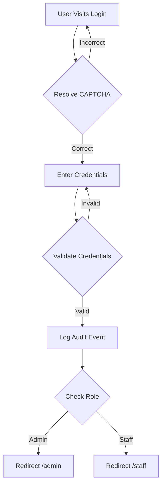
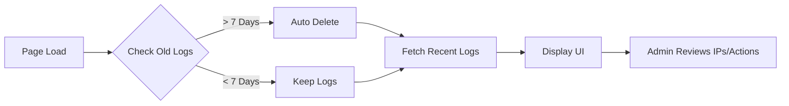
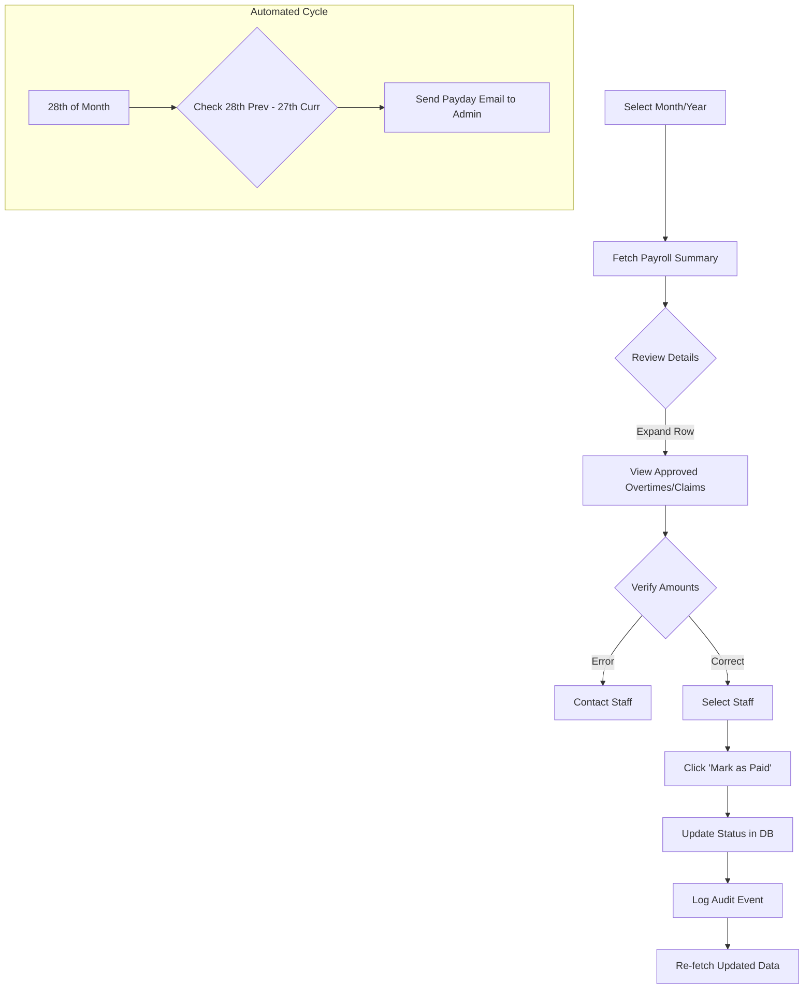

# WERK IDE - Application Documentation

## Overview
WERK IDE is a modern, Gen-Z styled internal tool for managing staff activities, including overtime logging, reimbursement claims, leave requests, and team engagement (Vibe Check). The application features a dual-role system (Admin & Staff) with robust security measures and comprehensive audit logging.

## 🚀 Features

### 1. Authentication & Security (Defense in Depth)
*   **Math CAPTCHA**: A rotating 20-second challenge to prevent bot attacks on login/register screens.
*   **Role-Based Access Control (RBAC)**: Strict separation between 'Staff', 'Admin', and 'Super Admin'.
*   **JWT Authentication**: Secure, expiration-based session management (24h).
*   **Rate Limiting**:
    *   *Login protection*: Limits failed attempts to prevent brute-force attacks.
    *   *API protection*: General rate limits on all endpoints to prevent DoS.
*   **File Sanitization**:
    *   Strict allow-list for file uploads (`.jpg`, `.jpeg`, `.png` only).
    *   Server-side image re-processing (via `sharp`) to strip malicious metadata.
*   **Audit Logging**: Detailed tracking of critical security events (Login, Password Change, Admin Actions).

### 2. Staff Features (The Hustle)
*   **Overtime Logging**: Log work hours with automatic duration calculation (Rp 40,000/hour flat rate).
*   **Reimbursement Claims**: Submit expenses with proof. File inputs strictly limit acceptance to image files.
*   **Leave Management**: Request Annual, Sick, or Unpaid leave. Real-time quota tracking.
*   **Side Quests**: View and accept extra tasks/bounties.
*   **Vibe Check**: Participate in anonymous/public polls.
*   **Security Profile**: Change password securely (requires current password verification).

### 3. Admin Features (The Boss)
*   **Daily Morning Brief**: Automated email at **08:00 AM** summarizing all pending tasks (Overtimes, Claims, Leaves) so you can start the day knowing exactly what needs attention.
*   **Dashboard Overview**: Quick stats on pending requests, payroll, and active users.
*   **User Management**:
    *   **Bento Grid Interface**: Modern UI for editing user profiles.
    *   **Security Zone**: Admins can reset staff passwords.
    *   **Danger Zone**: Permanent account deletion with confirmation.
*   **Payroll System**:
    *   **Drill-Down Details**: Expand staff rows to see exact breakdown of approved Overtimes and Claims.
    *   **Visibility Control**: Only "Approved" items appear in the payment view.
    *   **Bulk Processing**: "Mark as Paid" action updates status for all selected items.
    *   **Cycle Rules**: 
        *   The payroll cycle runs from the **28th of the previous month** to the **27th of the current month**.
        *   On the **28th at 09:00 AM**, an automated "PAYDAY ALERT" email is sent to all admins summarizing the total due.
*   **Audit Logs**:
    *   View chronological history of all security-critical events.
    *   Tracks: Timestamp, User, Action Type, Details, and Origin IP Address.
    *   **Auto-Retention**: Logs older than 7 days are automatically purged to save storage.

---

## 🔄 User Flows

### Login Flow


1.  **Access**: User visits `/login`.
2.  **Verification**: Solves the math CAPTCHA.
3.  **Credentials**: Enters Email and Password.
4.  **Audit**: Successful login is logged to Audit Trail.
5.  **Routing**: Redirects to appropriate dashboard based on Role.

### Security Audit Flow (Super Admin)


1.  **Access**: Navigate to **System > Audit Logs**.
2.  **Review**:
    *   See who logged in, who created/deleted users, and who modified financial records.
    *   Check "IP Address" to verify location (Public Origin IP).
3.  **Search**: Filter logs by User Name or Action type (e.g., "Delete").
4.  **Cleanup**: System automatically deletes logs > 7 days old upon page load.

### Payroll Flow (Admin)


**Note**: The system automatically generates a comprehensive invoice email on the **28th of every month**, covering approved activities from the 28th of the prior month to the 27th of the current month.

1.  **View**: Navigate to **Finance > Payroll**.
2.  **Filter**: Select Month/Year.
3.  **Inspect**: Click the arrow (`v`) next to a staff member to expand details.
    *   *Verify*: Check that only valid, approved items are listed.
4.  **Process**: Select staff members and click **Mark as Paid**.
    *   *Audit*: This action is logged as "Admin Processed Payout".
5.  **Export**: Download Excel report for external banking processing.

---

## 🛠️ Technical Architecture

### Tech Stack
*   **Frontend**: React, Vite, TailwindCSS (Glassmorphism), Lucide Icons.
*   **Backend**: Node.js, Express, Sequelize (SQLite).
*   **Security Middleware**: `helmet` (headers), `express-rate-limit`, `express-validator`, `multer` (upload limits).

### Database Schema (Key Models)
*   **Users**: `id`, `name`, `email`, `password` (hashed), `role`, `leaveQuota`, `staffId`.
*   **AuditLog**: `id`, `UserId`, `action`, `details`, `ip`, `createdAt`.
*   **Overtimes**: `id`, `UserId`, `status` ('Pending', 'Approved', 'Paid', 'Rejected'), `payableAmount`.
*   **Claims**: `id`, `UserId`, `status`, `proof` (sanitized path).

---

## 🐳 Production Deployment (Docker)

1.  **Configuration**:
    *   Ensure `.env` contains a strong `SECRET_KEY`.
2.  **Build & Run**:
    ```bash
    docker-compose up -d --build
    ```
3.  **Access**:
    *   Frontend: `http://localhost:81`
    *   API: `http://localhost/api`
    *   Uploads: `http://localhost/uploads` (Served securely via Nginx).
